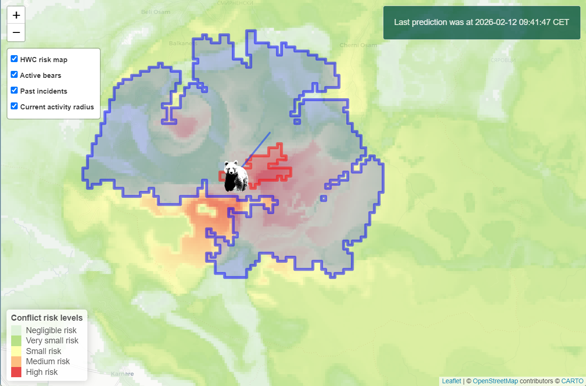

# The Human-Bear Conflict Radar

The following repository contains the code and files required to run the Human-Bear Conflict Radar, a digital twin for forecasting and monitoring conflict between humans and bears. Alongside this is a folder with the code used to develop the models used within the HBC Radar: the conflict risk model and the dispersal model. This work is described in detail within "Davison, A. M., Acosta, I., Arp, M., Doykin, N., Ganchev, N., Todorov, V. and de Koning, K. (*in review*). The Human-Bear Conflict Radar: An operational ecological digital twin for forecasting and monitoring conflict between humans and European brown bears (Ursus arctos) in Bulgaria." Further details and DOI for this publication will be shared here when available.

## File Descriptions
Below you will find a description of the files included which are required to run the HBC Radar:

**DTapp.R** This is the shiny app itself and you run the app from this code

**bearDT-lib.R** This contains custom functions used to run the app

**style.css** This file configures the style of the app

**Bear1.png** This file contains the icon for the active bears

**dynamic_conflict_model.rds** This file contains the random forest model used to create the monthly conflict risk forecast

**DEM_Stara_Planina.tif** The DEM used in the dispersal model from European Union's Copernicus Land Monitoring Service information. 2019. COP-DEM_GLO-30-DGED. Copernicus DEM. https://doi.org/10.5270/ESA-c5d3d65

*Files Not Included*

**predict_riskmap.csv** Large file containing the spatial information given to the random forest model to create the conflict risk forecast. This can be easily generated from raster input files for the randomforest model

**month_prediction.csv** A further large file containing the spatiotemporal information given to the random forest model dependent on the month. This can also easily be generated, most of the code to do so is in the 
conflict risk map script

**HWC risk map.tif** A template raster used to demark the area used within the HBC Radar. This can easily be done using any tif file which covers the study area

## Real-Time Data Connection
This app requires an account with the Sensing Clues platform to be able to access the Cluey API which enables the real-time conflict observation data to be fed into the digital twin. For an account, please see https://www.sensingclues.org/ for more information.
